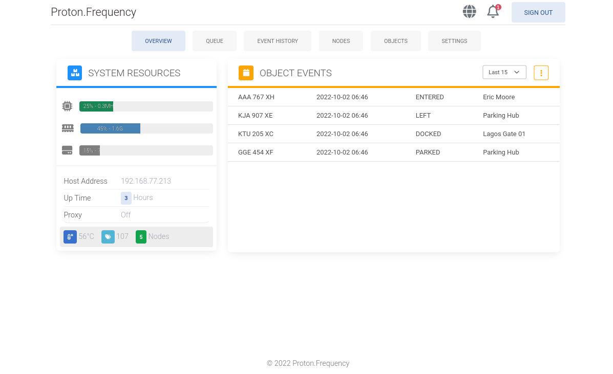

# Proton Frequency

Proton Frequency is RFID Reader daemon intended for IOT devices. It is able to identify commercial 125KHZ, 13.56MHZ, EPC Gen2 and ISO RFID Tags, reading, storing or forwarding details to API, MQTT or database.

## Devices models and protocols supported

Support status, company and resources for the devices are listed below.
NOTE: See product link or store url in docs folder.

| Name                | Model     | Channels    | Port | Status | Manufacturer         | Docs      |
| ------------------- | --------- | ----------- | ---- | ------ | -------------------- | --------- |
| Chafon              | CF-RU5102 | Serial      | 1731 | []     | Shenzhen Chafon Tech | In Folder |
| Generic (king-join) | None      | Serial, TCP | 1732 | []     | Shenzhen KingJoin    | In Folder |

## Roadmap for Proton Frequqncy

- [ ] IOT management UI initial version.
- [ ] Complete v1 of API endpoints.
- [ ] Complete current protocol implementation.
- [ ] implementation of MQTT state synchronization.
- [ ] Add proper documentation setup and usage.
- [ ] Add script for Raspberry Pi and Orange Pi.
- [ ] Add proper documentation for API endpoints.
- [ ] Complete and documentation serial channel.
- [ ] Complete network channel implementation.

## License

Copyright (c) 2022 <Godwin peter .O>me@godwin.dev

Permission is hereby granted, free of charge, to any person obtaining a copy of this software and
associated documentation files (the "Software"), to deal in the Software without restriction
including without limitation the rights to use, copy, modify, merge, publish, distribute, sublicense
and/or sell copies of the Software, and to permit persons to whom the Software is furnished to do so
subject to the following conditions:

The above copyright notice and this permission notice shall be included in all copies or substantial
portions of the Software.

THE SOFTWARE IS PROVIDED "AS IS", WITHOUT WARRANTY OF ANY KIND, EXPRESS OR IMPLIED, INCLUDING BUT NOT
LIMITED TO THE WARRANTIES OF MERCHANTABILITY, FITNESS FOR A PARTICULAR PURPOSE AND NONINFRINGEMENT.
IN NO EVENT SHALL THE AUTHORS OR COPYRIGHT HOLDERS BE LIABLE FOR ANY CLAIM, DAMAGES OR OTHER
LIABILITY, WHETHER IN AN ACTION OF CONTRACT, TORT OR OTHERWISE, ARISING FROM, OUT OF OR IN CONNECTION
WITH THE SOFTWARE OR THE USE OR OTHER DEALINGS IN THE SOFTWARE.
